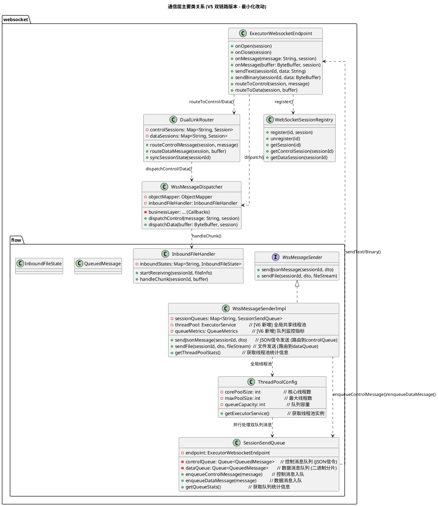
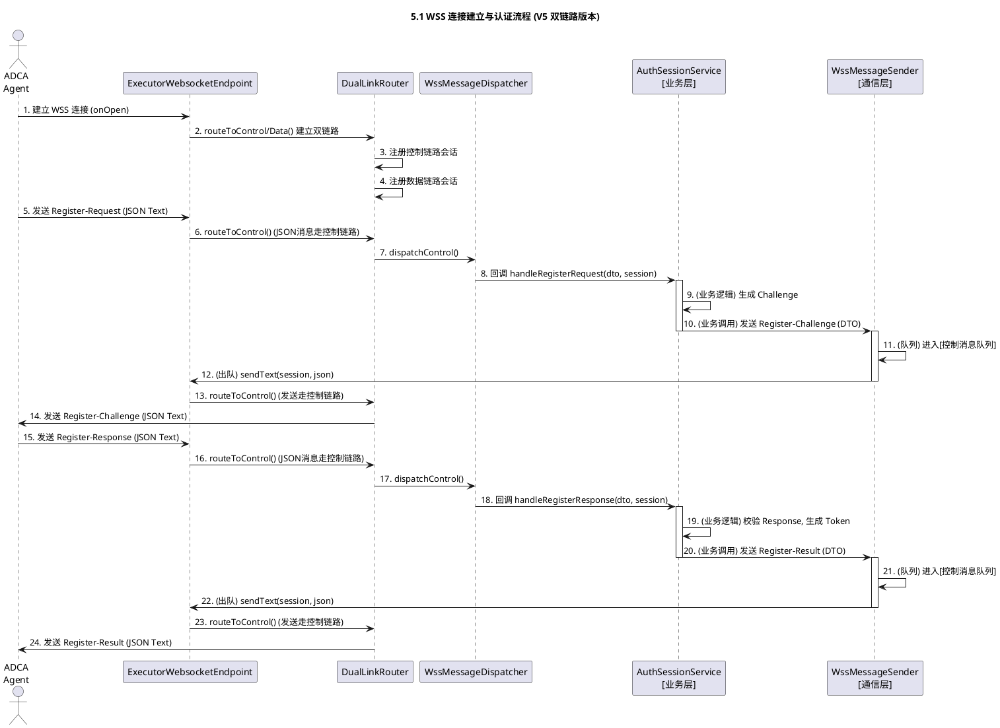
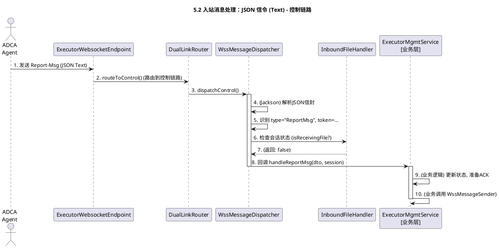
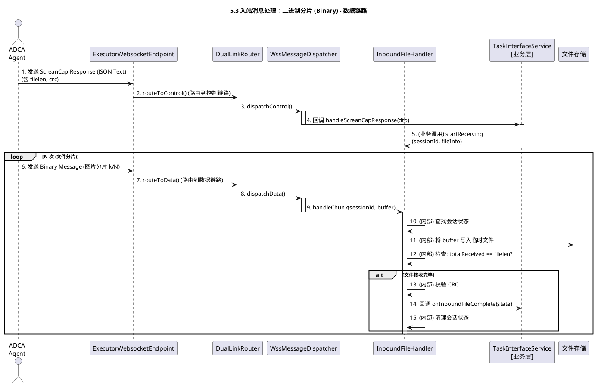
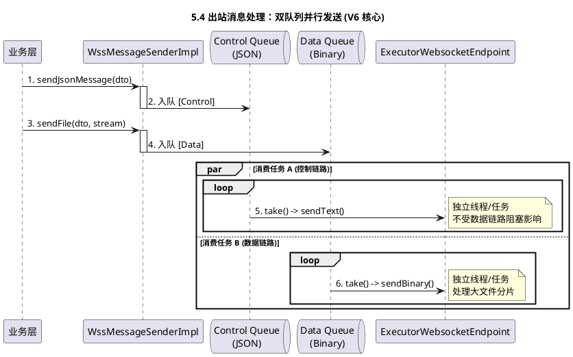
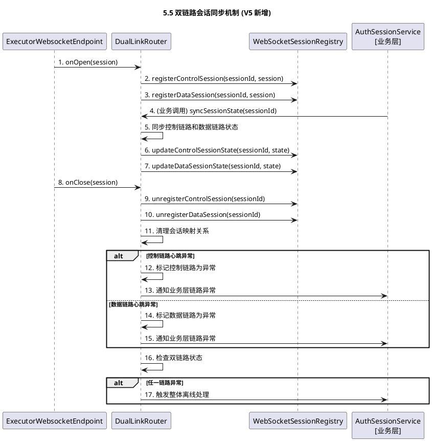

## 1\. 概述

### 1.1 项目背景与目标

本设计聚焦“执行机管理”的通信层实现，提供稳定的WSS长连接与**JSON信令编解码能力与二进制分片传输能力**，面向上层业务（认证、状态、任务）提供消息收发与会话管理基础设施。

### 1.2 关键需求

* 统一通信：所有Agent↔服务端交互走WSS
* **消息协议：JSON 结构 (Text)，清晰易读。**
* **会话安全：认证成功后发放8字节token，后续所有JSON消息强制携带。**
* **大文件传输：脚本、日志、截图等，通过“JSON信令+二进制分片”模式传输。**

## 2\. 系统架构

### 2.1 包结构设计（V5双链路版本 - 最小化改动方案）

```plaintext
com.huawei.cloududn.dialingtestapp
│
├── controller.executormanagement.websocket
│   ├── ControlLinkEndpoint.java            // [V5 新增] 控制链路端点
│   │                                       //   -> @ServerEndpoint("/ws/executor/control")
│   │                                       //   -> 处理JSON信令消息（Text Message）
│   ├── DataLinkEndpoint.java               // [V5 新增] 数据链路端点
│   │                                       //   -> @ServerEndpoint("/ws/executor/data")
│   │                                       //   -> 处理二进制分片消息（Binary Message）
│   ├── DualLinkRouter.java                 // [V5 新增] 双链路路由器
│   │                                       //   -> 负责关联控制链路和数据链路会话
│   │                                       //   -> 通过token/sessionId实现双链路绑定
│   │                                       //   -> 管理链路会话同步和状态一致性
│   ├── WssMessageDispatcher.java           // [V5 重构] 入站消息总协调器
│   │                                       //   -> 支持双链路消息类型区分
│   │                                       //   -> 控制链路：处理JSON信令
│   │                                       //   -> 数据链路：处理二进制分片
│   ├── WebSocketSessionRegistry.java       // [V5 重构] 会话注册表 (SessionId <-> Session)
│   │                                       //   -> 支持双链路会话管理
│   │                                       //   -> 提供链路状态查询和同步
│   │
│   ├── flow                                // [V6 优化] 负责消息流控、排队、文件传输
│   │   ├── WssMessageSender.java           // [V4 保留] (接口) 业务层依赖的【出站消息发送器】
│   │   ├── WssMessageSenderImpl.java       // [V6 优化] (实现) 双队列并行发送机制
│   │   │                                   //   -> 全局线程池 + 双队列管理
│   │   │                                   //   -> 控制消息和数据消息并行发送
│   │   ├── SessionSendQueue.java         // [V6 优化] 单个会话的【双队列管理器】
│   │   │                                   //   -> controlQueue: 控制消息队列 (JSON信令)
│   │   │                                   //   -> dataQueue: 数据消息队列 (二进制分片)
│   │   ├── QueuedMessage.java            // [V4 保留] POJO, 队列中的消息包装类 (Text/Binary)
│   │   │                                   //   -> 通过队列类型实现优先级控制
│   │   │
│   │   ├── InboundFileHandler.java         // [V4 保留] (组件) 【入站文件处理器】
│   │   │                                   //   -> 支持双链路文件传输
│   │   ├── InboundFileCompleteEvent.java // [V4 保留] (Spring事件) 文件接收完成事件
│   │   ├── InboundFileState.java         // [V4 保留] POJO, 存储单个入站文件的接收状态
│   │   ├── ThreadPoolConfig.java          // [V6 新增] 线程池配置类
│   │   │                                   //   -> 全局共享线程池，统一管理消息发送任务
│   │   └── QueueMetrics.java             // [V6 新增] 队列监控指标类
│   │
│   └── dto
│       ├── JsonMessageEnvelope.java        // [V4 保留] JSON消息信封 (type, token, payload)
│       ├── MessageType.java              // [V4 保留] 消息ID枚举 (0x01 -> REGISTER_REQUEST)
│       │
│       ├── RegisterRequestDto.java       // 0x01 (payload)
│       ├── RegisterChallengeDto.java     // 0x02 (payload)
│       ├── RegisterResponseDto.java      // 0x03 (payload)
│       ├── RegisterResultDto.java        // 0x04 (payload)
│       ├── DeRegisterRequestDto.java     // 0x05 (payload)
│       ├── DeRegisterAckDto.java         // 0x06 (payload)
│       ├── ReportMsgDto.java             // 0x11 (payload)
│       ├── ReportAckDto.java             // 0x12 (payload)
│       ├── AppListQueryDto.java          // 0x21 (payload)
│       ├── AppListResponseDto.java       // 0x22 (payload)
│       ├── AppInstallRequestDto.java     // 0x23 (payload) [V4 修改] (移除 package/script, 增加 filelen/crc/filetype)
│       ├── AppInstallResponseDto.java    // 0x24 (payload)
│       ├── ScreanCapQueryDto.java        // 0x25 (payload)
│       ├── ScreanCapResponseDto.java     // 0x26 (payload) [V4 修改] (移除 content, 增加 filelen/crc)
│       ├── ScriptUpdateNotifyDto.java    // 0x31 (payload) [V4 修改] (移除 scriptfile, 增加 filelen/crc)
│       ├── ScriptUpdateAckDto.java       // 0x32 (payload)
│       ├── TaskStartRequestDto.java      // 0x33 (payload)
│       ├── TaskStartResponseDto.java     // 0x34 (payload) [V4 修改] (移除 files, 增加 filelen/crc)
│       ├── TaskStopRequestDto.java       // 0x35 (payload)
│       ├── TaskStopResponseDto.java      // 0x36 (payload)
│       │
│       ├── UeItemDto.java                // 子对象
│       ├── AppItemDto.java               // 子对象
│       └── SubResultItemDto.java         // 子对象
│
├── config
│   └── WebSocketJsr356Config.java        // [V5 重构] 配置双链路WebSocket端点
│                                       //   -> 注册控制链路端点 /ws/executor/control
│                                       //   -> 注册数据链路端点 /ws/executor/data
│                                       //   -> 配置独立的缓冲区和超时参数
└── application.yml                       // [V5] 调整双链路缓冲区和超时配置
│
└── util
    └── Sha256HashUtil.java               // [V4 保留] SHA256哈希工具 (替代 NTLM)
```

### 2.2 系统类图设计（V5双链路版本 - 最小化改动方案）



### 2.3 V6版本文件变更统计（双队列并行发送版本 - 性能优化方案）

* **删除**：无（保持向后兼容）
* **新增**：
  - `DualLinkRouter.java` - 双链路路由器，负责控制链路和数据链路的消息分发
  - `ThreadPoolConfig.java` - 全局线程池配置类，统一管理消息发送任务
* **保留**：
  - `ExecutorWebsocketEndpoint.java` - 主端点（重构内部实现）
  - `WssMessageDispatcher.java` - 消息分发器（重构支持双链路）
  - `WebSocketSessionRegistry.java` - 会话注册表（重构支持双链路）
  - `flow` 包下所有文件 - 流量控制和文件传输组件
  - `dto` 包下所有文件 - 数据传输对象
  - `WebSocketJsr356Config.java` - WebSocket配置（重构支持双链路）
* **重大修改**：
  - `ExecutorWebsocketEndpoint`：重构为支持双链路路由，内部调用 `DualLinkRouter` 进行链路分发
  - `DualLinkRouter`：新增核心组件，负责将消息路由到控制链路或数据链路，管理链路会话同步
  - `WssMessageDispatcher`：重构为支持双链路消息类型区分，`dispatchControl()` 处理JSON信令，`dispatchData()` 处理二进制分片
  - `WebSocketSessionRegistry`：重构为支持双链路会话管理，提供 `getControlSession()` 和 `getDataSession()` 方法
  - `SessionSendQueue`：[V6重大改进] 从单一队列重构为双队列管理器
    - 新增 `controlQueue`：专门处理控制消息（JSON信令）
    - 新增 `dataQueue`：专门处理数据消息（二进制分片）
    - 移除 `unifiedQueue`，实现消息类型分离
  - `WssMessageSenderImpl`：[V6重大改进] 实现双队列并行发送机制
    - 集成全局线程池，实现真正的并行处理
    - 控制消息和数据消息通过独立队列并发发送
    - 移除复杂优先级判断，通过队列类型实现优先级控制
  - `WebSocketJsr356Config`：重构为配置双链路WebSocket端点，主端点 `/ws/executor` 内部路由到 `control/data` 子端点


## 3\. 子模块说明

### 3.1 WebSocket 网关 (WSS Gateway)

* 包路径：`controller.executormanagement.websocket`
* 职责：连接管理（OnOpen/OnClose）、**双链路路由、JSON信令(Text)与二进制分片(Binary)收发、JSON解码与分发、文件流管理**
* 输入：**Agent的WSS Text消息 (JSON) 和 Binary 消息 (分片)**；业务层出站消息（DTO）
* 输出：
  - 入站：**JSON解码为DTO后回调业务层**：`handleRegister/handleReport/handleTask...`
  - 出站：**`sendText(sessionId, String)` (JSON信令) / `sendBinary(sessionId, ByteBuffer)` (文件分片)**
* 依赖（向业务层暴露的回调）：`AuthSessionService/ExecutorMgmtService/TaskInterfaceService` 的 `handleXxx(...)`
* **V6优化特性**：
  - 通过`DualLinkRouter`实现控制链路和数据链路的消息路由
  - 支持双链路会话同步和状态一致性管理
  - 内部路由到`control`和`data`子链路处理不同类型消息
  - **双队列并行发送**：控制消息和数据消息通过独立队列并行发送

### 3.2 认证与会话服务 (Auth & Session Service)

本通信层不实现业务逻辑，仅回调业务层处理；需业务层实现四阶段CHAP并通过本层回传消息。
业务层通过DialUserService查询dial\_users表获取SHA256 Hash进行认证验证。

* **关键设计决策**：
  - **认证消息直接发送**：`Register-Challenge`、`Register-Result`等认证消息必须在token绑定前发送，采用**直接同步发送**方式，不走异步队列系统
  - **时序约束**：业务层必须严格遵循"①发送认证响应 → ②绑定token"的顺序，避免消息滞留导致客户端超时
  - 详见：[5.1.1 认证消息直接发送机制](#511-认证消息直接发送机制关键设计决策)

* **V6优化特性**：
  - 认证成功后在双链路上建立会话映射
  - 通过`DualLinkRouter`实现两条链路的状态同步
  - 同时管理控制链路和数据链路的会话状态
  - **双队列消息发送**：认证完成后的业务消息支持控制消息和数据消息的并行发送

### 3.3 执行机服务 (Executor Service)

同上，由业务层处理状态与UE信息；本层负责可靠收发与DTO解码。
* **V6优化特性**：
  - 需要同时跟踪控制链路和数据链路的执行机状态
  - 根据链路类型处理不同类型的消息
  - 通过`WebSocketSessionRegistry`的双链路会话管理功能获取会话信息
  - **并行消息处理**：利用双队列机制提高消息处理效率

### 3.4 持久化服务 (Persistence Service)

不在本层范围；本层无DB访问。

### 3.5 任务接口服务 (Task Interface Service)

由业务层发起出站消息（经JSON编码和`WssMessageSenderImpl`队列化）并通过`ExecutorWebsocketEndpoint`发送。
* **V6优化特性**：
  - 通过重构后的`WssMessageSenderImpl`发送消息，采用双队列并行发送机制
  - **控制消息队列**：专门处理JSON信令消息，优先级较高
  - **数据消息队列**：专门处理二进制分片消息，支持大文件传输
  - **全局线程池**：统一管理消息发送任务，实现真正的并行处理
  - 移除了复杂的优先级判断逻辑，通过队列类型实现优先级控制

### 3.6 北向API服务 (Northbound API)

与本层解耦；通过业务层间接驱动本层出站消息。

## 4\. 接口定义与数据模型

### 4.1 通信机制

#### 4.1.1 连接建立

* **V5双链路物理分离方案**：
  - **控制链路URL**: `wss://{server}:{port}/ws/executor/control`
  - **数据链路URL**: `wss://{server}:{port}/ws/executor/data`
* **V5双链路物理分离连接流程**：
  1. Agent先建立**控制链路**连接：`wss://{server}:{port}/ws/executor/control`
     - 控制链路完成CHAP认证流程
     - 认证成功后服务端分配8字节token
     - 控制链路用于发送JSON信令（心跳、任务控制等）
  2. Agent再建立**数据链路**连接：`wss://{server}:{port}/ws/executor/data`
     - 数据链路首条消息携带token进行身份关联
     - `DualLinkRouter`通过token绑定两条物理连接
     - 数据链路用于传输二进制文件分片
  3. 双链路状态同步：
     - `DualLinkRouter`维护token到双链路的映射关系
     - 任一链路断开都触发整体离线判断
     - 双链路独立心跳检测（30s周期）

#### 4.1.2 数据格式 (V5 JSON + 二进制分片)

**1. JSON 信令 (Text Message)**

所有非文件类消息、文件传输的起始信令，均使用Text Message + JSON格式，通过**控制链路**传输。

* **统一信封 (Envelope)**:
  
  ```json
  {
    "type": "RegisterRequest", // 消息类型 (对应MessageType枚举, 0x01 -> "RegisterRequest")
    "token": 1234567890123456, // 8字节会话ID (认证后必带)
    "requestId": "uuid-12345", // 可选：唯一请求ID，用于追踪
    "payload": {
      // 业务DTO (例如 RegisterRequestDto)
      "hostname": "agent-01"
    }
  }
  ```
  
  * **小二进制字段** (如 `challenge`, `response`): 在 `payload` 中使用 **Base64** 或 **Hex** 字符串编码。

**2. 二进制分片 (Binary Message)**

* 仅用于大文件（脚本、App、日志、截图）的**数据体**传输，通过**数据链路**传输。
* 格式：**原始二进制流 (Raw Binary)**，不带任何信封或头部。
* 传输：必须在一个JSON信令（如 `ScriptUpdate-Notify`）之后，通过`WssMessageSenderImpl`的**数据消息队列**连续发送N个Binary Message。
* **V6优化特性**：JSON信令通过**控制消息队列**发送，二进制分片通过**数据消息队列**发送，两者并行处理，提高传输效率。
* 接收方 (Agent) 收到JSON信令后，切换状态，开始接收后续的Binary Message，直到达到JSON信令中指定的 `filelen`。

#### 4.1.3 状态维护

* **双链路心跳机制**：
  - 控制链路：30s心跳周期，连续3周期未达判离线
  - 数据链路：30s心跳周期，连续3周期未达判离线
* **离线判断**：任一链路断开都应触发离线状态
* 若持续OFFLINE状态超过10天，可按运维策略进行自动老化（归档/清理）

#### 4.1.4 会话管理

* **双链路会话映射**：
  - 认证成功生成token（8字节），后续所有 **JSON信令消息** 必须携带
  - `DualLinkRouter`维护sessionId到控制链路和数据链路的会话映射
  - 连接断开token失效，两条链路的会话同时清理

#### 4.1.5 TLS证书与运维要点

* 证书预装：TLS证书随Agent安装包预置在 `certs/` 目录
* 证书更新：支持手动替换证书文件并重启Agent生效
* 约束：不支持证书在线更新

### 4.2 数据模型 (数据库表)

本通信层不涉及数据库表设计（由业务层负责）。

业务层相关表：

- `dial_users`：执行机用户表，密码字段存储SHA256 Hash（64位16进制）用于CHAP认证
- `executor`：执行机状态表，存储token、状态、最后在线时间等
- `ue`：UE设备表，存储绑定的执行机、设备信息等

详见：dial\_users表统一方案、执行机管理-业务逻辑设计。

### 4.3 接口定义 (WebSocket 消息)

#### 4.3.0 DTO字段命名规范说明

**JSON消息格式 vs Java DTO属性**

* **JSON消息格式**（在WebSocket上传输）：采用 **kebab-case**（短横线分隔）命名，如：`script-name`, `serial-no`, `challenge-id`, `app-list`
* **Java DTO属性**（代码中使用）：采用 **camelCase**（驼峰命名）命名，如：`scriptName`, `serialNo`, `challengeId`, `appList`
* **映射机制**：通过Jackson的 `@JsonProperty` 注解实现自动映射

**示例**：

```java
public class ScriptUpdateNotifyDto {
    @JsonProperty("script-name")
    private String scriptName;
    
    @JsonProperty("filelen")
    private Integer filelen;
    
    @JsonProperty("crc")
    private String crc;
}
```

下文表格中的字段名均为**JSON消息格式**（kebab-case），Java实现时需遵循上述映射规则。

#### 4.3.1 消息类型总览

| 类别 | 名称 | ID | 方向 |
| :--- | :--- | :--- | :--- |
| 注册 | Register-Request | 0x01 | ADCA → CloudUDN |
| | Register-Challenge | 0x02 | ADCA ← CloudUDN |
| | Register-Response | 0x03 | ADCA → CloudUDN |
| | Register-Result | 0x04 | ADCA ← CloudUDN |
| | DeRegister-Request | 0x05 | ADCA → CloudUDN |
| | DeRegister-Ack | 0x06 | ADCA ← CloudUDN |
| 状态 | Report-Msg | 0x11 | ADCA → CloudUDN |
| | Report-Ack | 0x12 | ADCA ← CloudUDN |
| UE\&App | AppList-Query | 0x21 | ADCA ← CloudUDN |
| | AppList-Response | 0x22 | ADCA → CloudUDN |
| | AppInstall-Request | 0x23 | ADCA ← CloudUDN |
| | AppInstall-Response | 0x24 | ADCA → CloudUDN |
| | ScreanCap-Query | 0x25 | ADCA ← CloudUDN |
| | ScreanCap-Response | 0x26 | ADCA → CloudUDN |
| 脚本&任务 | ScriptUpdate-Notify | 0x31 | ADCA ← CloudUDN |
| | ScriptUpdate-Ack | 0x32 | ADCA → CloudUDN |
| | TaskStart-Request | 0x33 | ADCA ← CloudUDN |
| | TaskStart-Response | 0x34 | ADCA → CloudUDN |
| | TaskStop-Request | 0x35 | ADCA ← CloudUDN |
| | TaskStop-Response | 0x36 | ADCA → CloudUDN |

## 5\. 通信层核心流程 (V5)

本章节从WSS通信层的视角，描述V5双链路版本下消息的收发、排队和分片处理的核心工作流程。

### 5.1 WSS 连接建立与认证 (V5 双链路版本)

此流程是通信层与业务层（`AuthSessionService`）的首次交互，用于验证Agent身份并建立双链路会话。



#### 5.1.1 认证消息直接发送机制（关键设计决策）

**设计原则**：认证消息必须**直接同步发送**，不走异步队列系统。

**核心原因**：如果认证消息走队列，会因消费者线程异步启动导致消息滞留，客户端超时失败。

**正确流程**：
```
1. 先发送 Register-Result（直接同步发送，此时token未绑定）
2. 再绑定 token（后续消息才走队列系统）
```

**架构分层**：

| 阶段 | 标识符 | 发送方式 | 时延要求 |
|-----|--------|---------|---------|
| 认证阶段 | sessionId | 直接同步发送 | < 100ms |
| 通信阶段 | token | 异步队列发送 | 可接受延迟 |

**关键要点**：
- 认证消息（`Register-Challenge`, `Register-Result`）必须在token绑定前发送
- 业务层严格遵循"先发送认证响应 → 后绑定token"顺序
- 认证完成后，业务消息自动切换到队列发送模式

### 5.2 入站消息处理：JSON 信令 (Text) - 控制链路

此流程用于通信层处理通过控制链路传输的标准JSON消息（如心跳`Report-Msg`）。



### 5.3 入站消息处理：二进制分片 (Binary) - 数据链路

此流程是V5的核心，展示了通信层如何通过数据链路接收Agent发送的大文件（如`ScreanCap-Response`）。



### 5.4 出站消息处理：双队列并行发送 (V6 核心)

此流程是V6设计的**核心改进**。它展示了`WssMessageSenderImpl`如何使用双队列并行发送机制，实现控制消息和数据消息的真正并行处理，大幅提升消息发送效率。



### 5.5 双链路会话同步机制

此流程展示了V5新增的双链路会话同步机制，确保控制链路和数据链路的会话状态保持一致。

