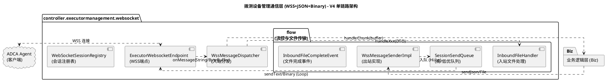
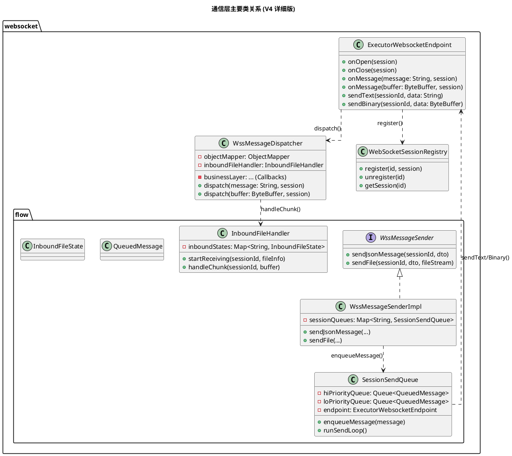
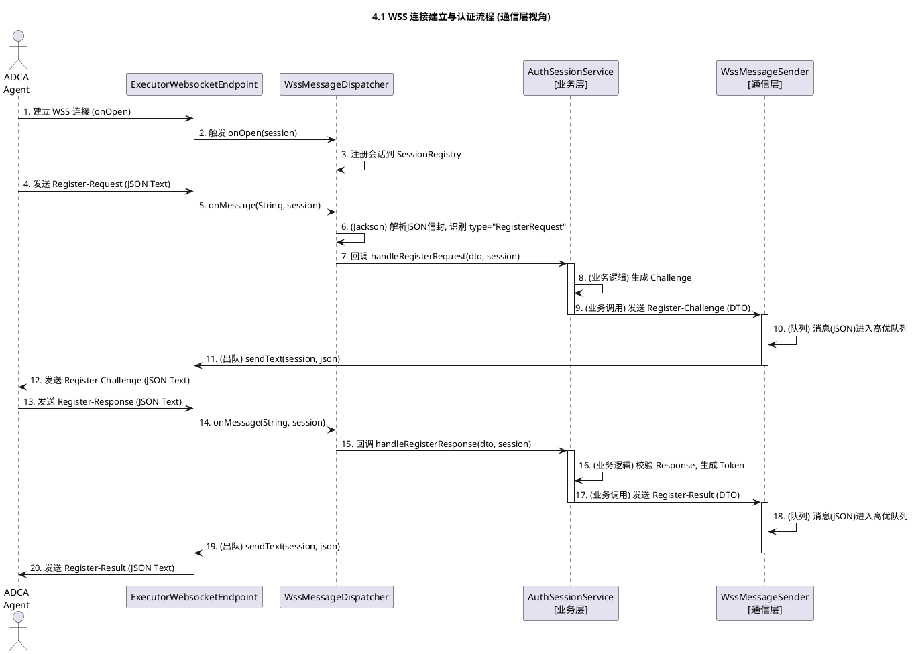
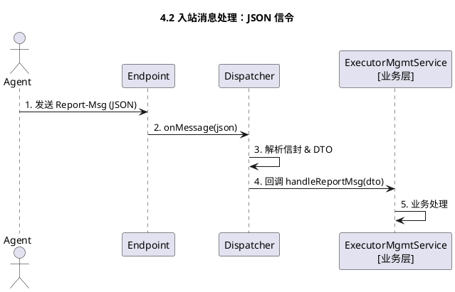
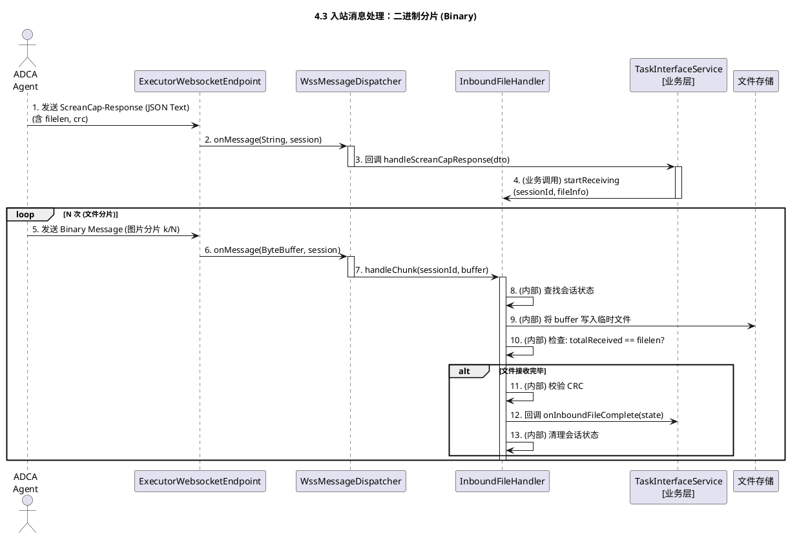
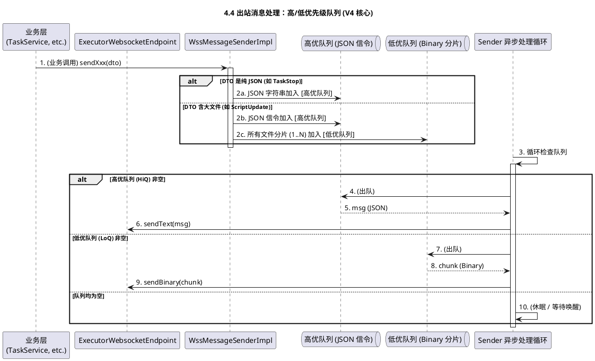
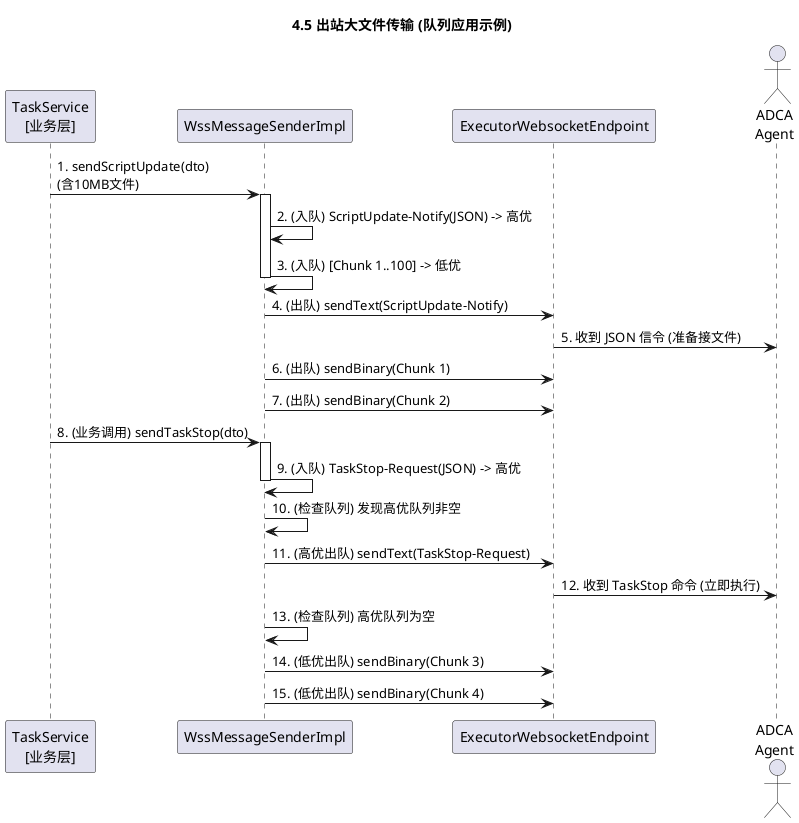

# 执行机管理 - WebSocket通信协议设计

## 1. 概述

本设计提供稳定的WSS长连接与**JSON信令编解码能力与二进制分片传输能力**。

## 2. 系统架构 (V4 单链路版本)

### 2.1 总体架构图



### 2.2 包结构设计

```plaintext
com.huawei.cloududn.dialingtestapp
│
├── controller.executormanagement.websocket
│   ├── ExecutorWebsocketEndpoint.java        // JSR-356 端点，处理 onOpen/Close/Message
│   ├── WssMessageDispatcher.java           // 入站消息协调：解析JSON信封，分发文件分片
│   ├── WebSocketSessionRegistry.java       // 会话注册表 (SessionId <-> Session)
│   │
│   ├── flow                                // 消息流控、排队、文件传输核心包
│   │   ├── WssMessageSender.java           // (接口) 业务层依赖的出站发送器
│   │   ├── WssMessageSenderImpl.java       // (实现) 管理SessionSendQueue，拆解消息入队
│   │   │
│   │   ├── SessionSendQueue.java         // [核心] 单会话的高/低优先级队列管理器
│   │   │                                   // 包含 Hi-Priority (JSON) 和 Lo-Priority (Binary) 队列
│   │   │
│   │   ├── QueuedMessage.java            // 队列中的消息包装类 (Text/Binary)
│   │   ├── InboundFileHandler.java         // 入站文件处理器，组装分片
│   │   ├── InboundFileCompleteEvent.java // 文件接收完成事件
│   │   └── InboundFileState.java         // 单个入站文件的接收状态上下文
│   │
│   └── dto
│       ├── JsonMessageEnvelope.java        // JSON消息信封 (type, token, payload)
│       ├── MessageType.java              // 消息ID枚举
│       ├── RegisterRequestDto.java       // [示例] 注册请求
│       ├── ReportMsgDto.java             // [示例] 心跳/状态报告
│       ├── ScriptUpdateNotifyDto.java    // [示例] 脚本下发 (带文件)
│       ├── TaskStopRequestDto.java       // [示例] 任务停止 (高优信令)
│       └── ... (其他业务DTO)
│
├── config
│   └── WebSocketJsr356Config.java        // WebSocket 配置
└── util
    └── Sha256HashUtil.java               // 工具类
```

### 2.3 系统类图



## 3. 接口定义与通信机制

### 3.1 基础机制

#### 3.1.1 连接与心跳
*   **URL**: `wss://{server}:{port}/ws/executor`
*   **心跳**: 30s 周期；连续 3 周期未达判离线。
*   **会话**: 认证成功生成 `token` (8字节)，后续所有 JSON 信令必须携带。

### 3.2 数据格式

**1. JSON 信令 (Text Message)**
所有控制消息使用 JSON 格式，包含统一信封：
```json
{
  "type": "RegisterRequest",
  "token": 1234567890123456,
  "payload": { ... } // 业务DTO
}
```

**2. 二进制分片 (Binary Message)**
仅用于大文件传输。必须紧跟在关联的 JSON 信令（含 `filelen`, `crc`）之后发送。格式为原始二进制流。

### 3.3 关键消息定义示例

#### (1) 注册消息：Register-Request (0x01)
*   **用途**：客户端发起注册，开始 CHAP 认证流程。
*   **Payload**: `hostname` (string)

#### (2) 心跳/状态：Report-Msg (0x11)
*   **用途**：Agent 定期上报状态（心跳）。
*   **Payload**: `token` (long), `state` (string), `ue-list` (array)

#### (3) 脚本下发：ScriptUpdate-Notify (0x31) - [带文件]
*   **用途**：服务端下发脚本文件。**发送此信令后，立即发送 N 个二进制分片。**
*   **Payload**:
    *   `script-name`: string
    *   `version`: string
    *   `filelen`: int (文件总字节数)
    *   `crc`: string (校验码)

#### (4) 任务停止：TaskStop-Request (0x35) - [紧急信令]
*   **用途**：服务端下发停止指令。此消息为纯信令，需**插队**优先发送。
*   **Payload**: `taskid` (int), `script-name` (string)

## 4. 核心业务流程 (V4)

### 4.1 WSS 连接建立与认证流程

此流程建立会话并分发 Token。



### 4.2 入站消息处理：JSON 信令 (Text)

此流程用于通信层处理标准JSON消息（如心跳`Report-Msg`）。

*   **解析逻辑**：`Endpoint` 收到 Text 消息后，`Dispatcher` 解析 JSON 信封，识别 `type` 字段。
*   **业务分发**：根据 `type` 将 Payload 转换为对应的 DTO，并回调业务层接口（如 `handleReportMsg`）。



### 4.3 入站消息处理：二进制分片 (Binary)

此流程是V4的核心，展示了通信层如何接收Agent发送的大文件（如`ScreanCap-Response`）。



### 4.4 出站消息处理：高/低优先级队列 (V4 核心)

此流程是V4设计的**灵魂**。它展示了`WssMessageSenderImpl`如何使用两个队列来确保**控制信令（高优）总能优先于文件分片（低优）**。



### 4.5 出站大文件传输 (队列应用)

此流程演示了5.5中的高/低优队列设计，在实际大文件传输过程中，如何被高优先级消息（如`TaskStop`）**插队**。


