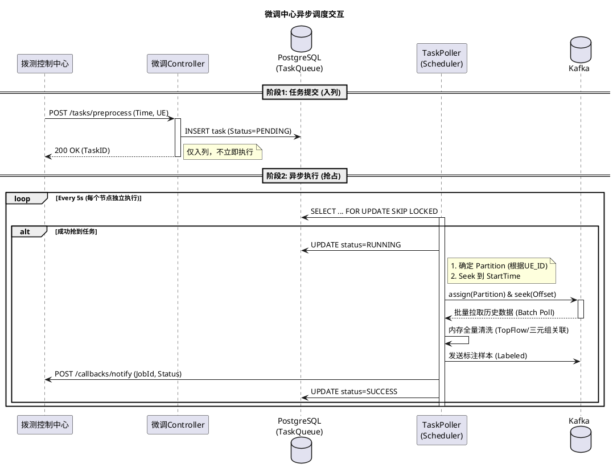
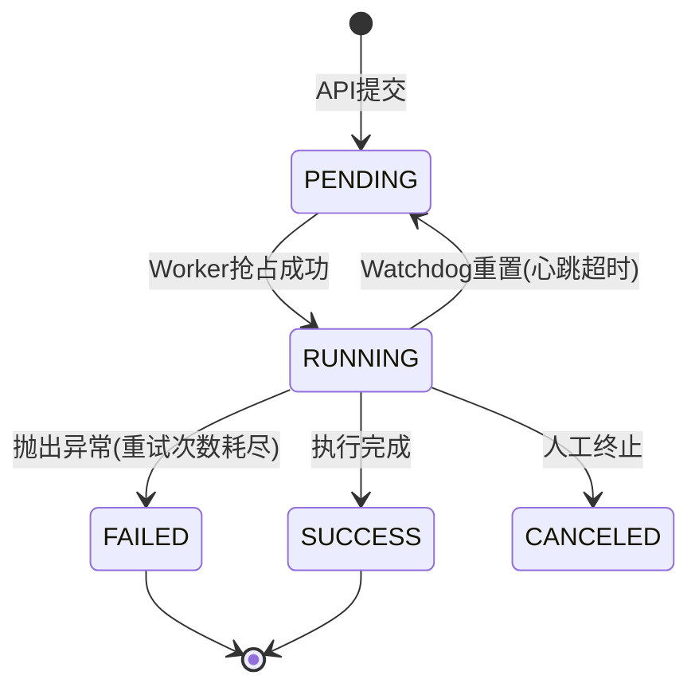

# 微调中心应用服务 (FinetuningApp Service) 设计说明书

## 1. 概述

### 1.1 服务定位与核心职责
`finetuningapp-service` 是微调中心的**业务执行引擎**。它作为**原子能力提供者**，负责对接拨测控制中心指令，调度底层 C++ 服务（`ProtocolMiner`），并采用**“流式批处理”**模式回放 Kafka 历史数据进行业务清洗。

本服务不涉及底层物理存储与模型训练计算，**也不包含自动触发与多轮迭代的决策逻辑**（这些由拨测控制中心编排）。核心聚焦于以下职责：

1.  **原子任务执行**：响应北向指令，执行预处理、训练、回放等原子任务。
2.  **离线回放与清洗**：按需回放 Kafka 历史数据，在内存中执行流量特征分析与样本清洗。
3.  **资产版本管理**：管理模型、检索库的版本元数据及样本库统计信息。

### 1.2 技术选型
* **语言框架**: Java 21, Spring Boot 2.7, MyBatis
* **数据存储**: PostgreSQL (任务队列/业务数据), Redis (规则缓存/热点数据)
* **接口规范**: OpenAPI 2.0 (YAML), 详见 `dialingtest-interface` 项目
* **通信协议**:
    * **RESTful API**: 指令交互 (vs 拨测中心 / C++服务 / EPSN)
    * **Kafka**: 历史数据存储与回放 (Batch Consumer)


## 2. 系统架构与包结构设计

### 2.1 逻辑架构组件

本服务的核心逻辑重构为 **“异步提交 -> 抢占调度 -> 离线回放 -> 内存计算”**。架构包含以下四个主要模块：

#### 2.1.1 接口交互层 (Interface & Adaptation)

  * **北向交互模块 (Northbound Integration)**:
      * **API Server**: 暴露 RESTful 接口，接收拨测中心的指令并写入队列。
      * **Callback Client**: 封装 HTTP 客户端，负责在任务结束时向拨测中心发送异步通知（重试与熔断保护）。
  * **南向适配模块 (Southbound Adapter)**:
      * **Algo-Engine Client**: 封装与 C++ 算力服务 (`ProtocolMiner`) 的交互接口。

#### 2.1.2 分布式调度层 (Scheduler Layer) 

  * **任务轮询器 (Task Poller)**:
      * 周期性扫描数据库，使用 `FOR UPDATE SKIP LOCKED` 机制抢占 `PENDING` 状态的任务。
      * 确保每个任务在同一时刻仅被一个服务实例执行（实现单机单线程单 UE 处理）。
  * **看门狗 (Watchdog)**:
      * 维护运行中任务的心跳，防止因服务宕机导致任务死锁（超时自动重置状态）。

#### 2.1.3 核心业务层 (Core Services)

  * **内存清洗引擎 (In-Memory Cleaning Engine)**:
      * **流式聚合**: 采用流式处理模式，边读取边聚合，仅保留统计值和有限的采样明细，避免全量数据占用内存。
      * **内存计算**:
          * **TopFlow 排序**: 基于聚合后的统计特征（而非原始流）进行排序。
          * **蓄水池采样**: 在聚合过程中保留 Top N 候选集的有限明细数据。
  * **任务执行器 (Task Executor)**:
      * 负责编排“Kafka 回放 -> 内存清洗 -> 结果写回 -> **回调通知** -> 更新状态”的原子流程。
  * **资产管理模块 (Asset Management)**:
      * 管理模型版本元数据和样本库统计信息。

#### 2.1.4 基础设施层 (Infrastructure)

  * **Kafka 回放模块**:
      * **Batch Replay Consumer**: 不使用 Group ID 消费，而是使用 `assign` + `seek` 模式，精确读取指定 Partition 的历史数据。
  * **数据持久化**: PostgreSQL (任务队列与元数据), Redis (可选，仅作辅助缓存)。

-----

### 2.2 项目包结构设计
    
根包名为 `com.huawei.cloududn.finetuningapp`。结构上明确区分**自动生成代码 (OpenAPI)** 与**核心业务代码**。

```plaintext
com.huawei.cloududn.finetuningapp
├── api                             // [Generated] OpenAPI 生成层 (target/generated-sources)
│   ├── FinetuningApi.java          // 接口定义 Interface
│   └── model                       // DTO (Request/Response, e.g. TaskCreateReq)
│
├── controller                      // 1. 对外接口层 (实现 OpenAPI 接口)
│   ├── TaskController.java         // implements FinetuningApi
│   ├── ModelController.java        // 模型版本查询
│   └── RuleController.java         // 默认清洗规则配置
│
├── service                         // 2. 核心业务逻辑层
│   ├── scheduler                   // 2.1 调度层
│   │   ├── TaskPoller.java         // 定时扫描 & 抢占任务
│   │   └── TaskWatchdog.java       // 任务保活与故障恢复
│   │
│   ├── executor                    // 2.2 任务执行层
│   │   ├── PreprocessExecutor.java // 预处理：回放 -> 清洗 -> 生产
│   │   ├── TrainingExecutor.java   // 训练调度
│   │   └── ReplayExecutor.java     // 回放调度
│   │
│   ├── engine                      // 2.3 内存清洗引擎
│   │   ├── InMemoryCleaningEngine.java // 引擎入口
│   │   ├── DataLoader.java         // Kafka 历史数据加载器
│   │   └── algorithm               // 纯内存算法实现
│   │       ├── TopFlowSorter.java  // 流量排序算法
│   │       ├── TupleMatcher.java   // 关联匹配算法
│   │       └── FeatureFilter.java  // 特征过滤
│   │
│   ├── asset                       // 2.4 资产管理
│   │   ├── ModelVersionService.java
│   │   └── SampleStatsService.java
│   │
│   └── external                    // 2.5 外部适配
│       └── algo
│           └── ProtocolMinerClient.java // 调用 C++ 接口
│
├── dao                             // 3. 数据访问层 (MyBatis/JPA)
│   ├── FinetuningTaskDao.java      // 包含 lockTask() 方法
│   ├── ModelVersionDao.java
│   └── RuleConfigDao.java          // 存储默认/历史规则配置
│
├── model                           // 4. 内部数据模型 (手写)
│   ├── entity                      // DB实体 (TaskEntity 增加 worker_ip)
│   ├── kafka                       // Kafka 消息体定义
│   └── domain                      // 领域模型 (FlowObject, CleanResult)
│
├── infra                           // 5. 基础设施
│   ├── kafka
│   │   ├── ReplayConsumer.java     // 封装 seek/poll 逻辑
│   │   └── SampleProducer.java     // 生产清洗后的数据
│   └── config                      // AppConfig, KafkaConfig
│
└── FinetuningApplication.java      // 启动类
```


## 3\. 接口设计与边界定义

本服务作为微调业务的控制中枢，通过 RESTful API 对外提供服务，并通过 HTTP Client 驱动底层算力引擎。接口设计遵循 **API First** 原则。

### 3.1 接口协议规范

本服务遵循 **API First** 开发模式。所有 RESTful 接口的路径、参数、请求/响应体（DTO）均在 `dialingtest-interface` 项目的 OpenAPI 2.0 YAML 文件中定义。

*   **代码生成**: 服务端接口 (`Interface`) 和 数据传输对象 (`DTO`) 由 Maven 插件自动生成。
*   **文档权威性**: 本文档仅描述核心业务交互逻辑，具体字段定义以 YAML 文件为准。
*   **通用响应结构**:
    ```json
    {
      "code": 200,
      "message": "Success",
      "data": { ... }       // 对应 OpenAPI 定义的 Response DTO
    }
    ```

-----

### 3.2 北向接口设计 (对外提供)

**调用方**: 拨测控制中心 (`dialingtestapp-service`) 或 前端管理台。
**Base URL**: `/api/finetuning/v1`

#### 3.2.1 任务触发类接口

此类接口用于接收上游的业务指令，均为**异步入列接口**。接口返回成功仅代表任务已安全写入数据库队列（`PENDING` 状态），实际执行由后台调度器抢占触发。

| 接口名称 | HTTP 方法 | URI 路径 | 说明 |
| :--- | :--- | :--- | :--- |
| **提交预处理任务** | `POST` | `/tasks/preprocess` | 拨测结束后调用。将任务写入队列，等待调度器回放数据并清洗。 |
| **提交模型训练任务** | `POST` | `/tasks/train` | **说明**: 由拨测控制中心基于阈值判断后调用，或由管理员手动调用。触发底层 C++ 进行模型训练或检索库生成。 |
| **提交离线回放任务** | `POST` | `/tasks/replay` | 使用指定模型版本对历史样本进行回放验证。 |
| **终止任务** | `POST` | `/tasks/{taskId}/stop` | 标记任务状态为 `CANCELED`，调度器识别后停止执行。 |

**1. 提交预处理任务 (请求示例)**

```json
// POST /tasks/preprocess
{
  "dialing_task_id": "10086",     // 关联的拨测任务ID
  "ue_id": "ue-001-sim2",         // 数据来源设备 (将作为 Kafka Partition Key)
  "time_range": {                 // 关键：用于 Kafka Seek 回放的时间区间
    "start": 1698300000000,
    "end": 1698300300000
  },
  "config": {                     // 临时覆盖的清洗规则 (可选)
    "app_type": "DouYin_Live",    // 期望标注的APP类型
    "min_packet_count": 50        // 最小包数阈值
  }
}
// 响应: {"code": 200, "data": {"job_id": "job-pre-778899", "status": "PENDING"}}
```

**2. 提交模型训练任务 (请求示例)**

```json
// POST /tasks/train
{
  "trigger_source": "MANUAL",      // 触发源: MANUAL(人工), THRESHOLD(自动阈值)
  "model_type": "LARGE_MODEL_RAG", // LARGE_MODEL_RAG (检索库) 或 SMALL_MODEL (分类器)
  "data_scope": {
    "sample_ids": [],             // 指定样本ID列表
    "start_time": 1690000000000
  }
}
// 响应: {"code": 200, "data": {"job_id": "job-train-556677", "status": "PENDING"}}
```

**3. 提交离线回放任务 (请求示例)**

```json
// POST /tasks/replay
{
  "model_version": "v2.3.0-rag",   // 指定待验证的模型版本
  "dataset_scope": "INCREMENTAL",  // INCREMENTAL(增量), FULL(全量)
  "target_metrics": ["accuracy", "recall"]
}
// 响应: {"code": 200, "data": {"job_id": "job-replay-112233", "status": "PENDING"}}
```

#### 3.2.2 资产管理类接口

此类接口主要用于查询和元数据管理。

| 接口名称 | HTTP 方法 | URI 路径 | 说明 |
| :--- | :--- | :--- | :--- |
| **查询模型版本列表** | `GET` | `/assets/models` | 分页查询模型版本、下载地址、评估指标。 |
| **查询样本统计** | `GET` | `/assets/samples/stats` | **说明**: 查询各类 APP 的样本数量。支持按 `time_range` (新增量) 或 `dialing_task_id` 过滤，供控制中心做阈值判断。 |
| **更新清洗规则** | `PUT` | `/configs/rules/default`| 修改系统默认的全局清洗规则配置。 |

#### 3.2.3 异步回调机制 (系统约定)

本服务与拨测控制中心采用**约定式回调**。
1. **配置**: 服务端需配置拨测中心的 Base URL (例如 `app.dialing-service.url=http://dialing-service:8080`)。
2. **触发**: 当任务状态变更为 `SUCCESS` 或 `FAILED` 时，自动调用约定的通知接口。
3. **路径**: `{Base URL}/dialingtest/callbacks/notify`

**请求体定义 (POST)**:

```json
{
  "async_job_id": "job-pre-778899",  // 对应提交时返回的 job_id
  "status": "SUCCESS",               // SUCCESS, FAILED
  "result_data": {                   // 任务产出 (对应 t_finetuning_task.result_data)
     "model_version": "v20231027.1", // (训练任务产出)
     "metrics": { "accuracy": 0.95 } // (回放任务产出)
  },
  "error_message": null              // 失败时的错误信息
}
```

-----

### 3.3 外部集成边界 (External Integration)

本服务不仅被动接收指令，还需要主动调用外部系统。

**1. 南向调用 (Downstream)**: 调用 C++ 算力服务 (`ProtocolMiner`) 执行物理操作。
**2. 北向回调 (Upstream)**: 调用 拨测控制中心 (`DialingTestApp`) 反馈任务状态。

| 动作类型 | 交互方向 | 接口/机制 | 数据交互内容 |
| :--- | :--- | :--- | :--- |
| **物理提取** | Java -> C++ | `POST /algo/v1/extract` | 下发时间段和 UE ID。 |
| **算法训练** | Java -> C++ | `POST /algo/v1/train` | 下发样本集合路径、算法参数。 |
| **训练/提取结果** | C++ -> Java | `POST /internal/callbacks/algo` | **系统约定**: C++ 完成耗时任务后回调此接口。 |
| **状态通知** | Java -> Dialing | `POST /dialingtest/callbacks/notify` | **系统约定**: 任务结束时回传 JobID 和 Result。 |

#### 3.3.1 南向接口协议定义 (MVP)

为解耦耗时计算，Java 与 C++ 采用 **"异步提交 + 回调通知"** 模式。

**1. 提交训练任务 (Java -> C++)**

*   **URL**: `http://{cpp-service}/algo/v1/train`
*   **Method**: `POST`

```json
{
  "job_id": 10086,                 // Java端的任务ID (用于回调时对账)
  "callback_url": "http://finetuning-service:8080/internal/callbacks/algo", 
  "model_type": "LARGE_MODEL_RAG", 
  "data_source": {
    "sample_path": "s3://bucket/samples/20231027/", 
    "time_range": { "start": 1698300000, "end": 1698303600 }
  },
  "hyper_params": { "epoch": 10 }
}
// Response: 200 OK {"code": 0, "message": "Accepted"}
```

**2. 接收算力回调 (C++ -> Java)**

*   **URL**: `/internal/callbacks/algo`
*   **Method**: `POST`
*   **说明**: 专用于接收南向算力节点的通知。

```json
{
  "job_id": 10086,          // 对应提交时的ID
  "status": "SUCCESS",      // SUCCESS, FAILED
  "error_msg": null,        
  "result": {               // 成功时的产出物
    "model_version": "v20231027.1",
    "artifact_path": "s3://bucket/models/v20231027.1.bin",
    "metrics": { "accuracy": 0.95 }
  }
}
```

---

### 3.4 数据流边界 (Kafka Topic)

除 API 外，**Kafka Topic** 是本服务重要的数据输入输出边界。为保证高性能与跨语言兼容，消息体采用 **Protobuf (Protocol Buffers)** 序列化。

*   **输入 Topic (`topic-raw-flow`)**:
    *   **来源**: `ProtocolMiner` (C++)。
    *   **序列化**: `Protobuf v3` (二进制)。
    *   **Key**: `UE_ID` (String, UTF-8)。
    *   **Value**: `RawFlowMsg` (定义见下文)。
    *   **关键约束**: **Partition Key 必须为 `UE_ID`**。
        *   *原因*：调度器在回放时，需要确保同一个 UE 的数据集中在同一个（或少量几个）Partition 中，以便 Worker 可以通过 `assign` 指定分区并高效读取该 UE 在该时间段的全量数据。

*   **输出 Topic (`topic-labeled-sample`)**:
    *   **去向**: `ProtocolMiner` (用于入库/训练) 或 实时大屏。
    *   **内容**: 经过内存清洗、带有业务标签 (Label) 的标准样本数据。
    *   **序列化**: `JSON` (考虑到对接实时大屏或第三方系统的通用性，输出量较小，可用 JSON)。

#### 3.4.1 Protobuf 定义 (Draft)

```protobuf
syntax = "proto3";
package com.huawei.cloududn.finetuningapp.model.proto;

message RawFlowMsg {
  string ue_id = 1;          // 设备ID
  int64 timestamp = 2;       // 采集毫秒时间戳
  
  // 五元组
  string src_ip = 3;
  string dst_ip = 4;
  int32 src_port = 5;
  int32 dst_port = 6;
  string l4_proto = 7;       // TCP/UDP

  // 统计特征
  int64 up_bytes = 8;
  int64 down_bytes = 9;
  int32 packet_count = 10;
  
  // 摘要 (用于后续Payload特征分析)
  bytes payload_snippet = 11; 
}
```

### 3.5 核心交互时序图 (界限示意)



## 4. 数据模型设计

### 4.1 设计原则

1.  **API 契约驱动**: API DTO 完全由 OpenAPI 自动生成，禁止在 Controller 层手动定义 POJO。
2.  **配置即代码**: 清洗规则和算法参数大量使用 `JSONB` 格式存储，以应对未来算法参数的频繁变更。
3.  **状态驱动调度**: 任务表不仅是记录，更是**分布式队列**。通过 DB 行锁机制实现任务分发。
4.  **元数据索引**: 仅存储指向底层存储（DFS/S3）的路径指针，不存储物理文件。
    
### 4.2 详细表结构设计
    
#### 4.2.1 任务流水表 (`t_finetuning_task`)
**用途**: 既是业务流水日志，也是**分布式任务队列**。

| 字段名 | 类型 | 约束 | 说明 |
| :--- | :--- | :--- | :--- |
| `id` | `bigint` | PK, Auto Inc | 任务唯一标识 (Job ID) |
| `dialing_task_id` | `bigint` | Index | 关联的拨测控制中心任务 ID |
| `job_type` | `varchar(32)` | Not Null | `PREPROCESS`, `TRAIN`, `REPLAY` |
| `status` | `varchar(32)` | Not Null | `PENDING` (待抢占), `RUNNING` (执行中), `SUCCESS`, `FAILED`, `CANCELED` |
| `request_params` | `jsonb` | | 任务入参快照 (UE, TimeRange, TempRule) |
| `result_data` | `jsonb` | | 任务产出 (Stats, ModelPath) |
| `worker_instance` | `varchar(64)` | | **调度字段**: 当前抢占该任务的服务实例 ID (e.g., `pod-ip:port`) |
| `heartbeat_time` | `timestamp` | | **调度字段**: 任务最后一次保活心跳时间。超时(如5min)未更新则被 Watchdog 重置为 PENDING。 |
| `retry_count` | `int` | Default 0 | **调度字段**: 重试次数 |
| `error_msg` | `text` | | 失败堆栈 |
| `create_time` | `timestamp` | Default Now | 入列时间 |
| `start_time` | `timestamp` | | 开始执行时间 |
| `end_time` | `timestamp` | | 完成时间 |

> **索引建议**: `idx_status_heartbeat` (用于 Poller 扫描和 Watchdog 监控)。

#### 4.2.2 清洗规则配置表 (`t_cleaning_rule`)

**用途**: 存储数据清洗和标注的逻辑规则。

| 字段名 | 类型 | 约束 | 说明 |
| :--- | :--- | :--- | :--- |
| `id` | `bigint` | PK, Auto Inc | 规则 ID |
| `name` | `varchar(64)` | Not Null | 规则名称 |
| `app_type` | `varchar(64)` | Index | 适用的应用类型 (e.g., `DouYin_Live`) |
| `is_default` | `boolean` | Default False | 是否为该应用的默认规则 |
| `rule_config` | `jsonb` | Not Null | **核心规则体** (JSON) |
| `description` | `varchar(255)`| | 描述 |
| `create_time` | `timestamp` | | 创建时间 |

#### 4.2.3 模型/检索库版本表 (`t_model_version`)

**用途**: 管理生成的资产（模型文件或向量检索库），记录其血缘关系和质量指标。

| 字段名 | 类型 | 约束 | 说明 |
| :--- | :--- | :--- | :--- |
| `id` | `bigint` | PK, Auto Inc | 版本 ID |
| `version_no` | `varchar(64)` | Unique | 版本号 (e.g., `v20231027.1`) |
| `model_type` | `varchar(32)` | Not Null | `SMALL_MODEL`, `RAG_LIB` |
| `storage_path` | `varchar(255)`| Not Null | DFS/S3 物理路径 |
| `metrics` | `jsonb` | | 质量指标快照 |
| `source_task_id` | `bigint` | Index | 来源任务 ID |
| `is_active` | `boolean` | Default False | 是否为当前推荐版本 |
| `create_time` | `timestamp` | | 生成时间 |

#### 4.2.4 样本统计表 (`t_sample_statistics`)

**用途**: 记录各类应用的样本积累情况（聚合结果）。

| 字段名 | 类型 | 约束 | 说明 |
| :--- | :--- | :--- | :--- |
| `id` | `bigint` | PK, Auto Inc | ID |
| `app_type` | `varchar(64)` | Unique Index | 应用类型 |
| `total_count` | `bigint` | | 累计样本总数 |
| `last_update_time`| `timestamp` | | 最后更新时间 |

-----

### 4.3 关键 JSON 结构示例

**1. 预处理任务参数 (`t_finetuning_task.request_params`)**

```json
{
  "ue_id": "ue-001",
  "time_window": {
    "start_ts": 1698300000000,
    "end_ts": 1698300300000
  },
  "runtime_rule_override": {  // 本次任务临时的规则覆盖
    "min_traffic_bytes": 10240
  }
}
```

**2. 清洗规则定义 (`t_cleaning_rule.rule_config`)**

```json
{
    "protos": [
        {"id": "xxx", "name": "DouYin_Live"}
    ],
    "clean_rule": {
        "min_traffic": 10240,
        "min_duration": 5,
        "pure_ratio": 0.8
    },
    "label_proto_rule": [
        {
            "rule_type": "top_flow",
            "top": 10,
            "to_proto_id": "xxx",
            "aggre_by": ["l4proto", "dstip", "srcport"], // 关键：支持动态聚合
            "condition": {
                "traffic": 100,
                "effective_proportion": 0.6,
                "domain_regex": ".*\\.douyin\\.com" // 域名正则支持
            }
        }
    ]
}
```

## 5. 组件详细设计

本章详细阐述核心业务模块的内部实现逻辑，重点描述分布式任务调度机制、Kafka 历史数据回放技术以及内存清洗算法的实现。

### 5.1 分布式任务调度机制 (Scheduler)

不再依赖 HTTP 负载均衡分发任务，而是采用 **"Pull-Based" (拉取式)** 的抢占模型。所有服务实例对等，通过数据库锁争抢任务。

#### 5.1.1 任务状态机



#### 5.1.2 抢占逻辑实现 (`TaskPoller`)

核心依赖 PostgreSQL 的 `FOR UPDATE SKIP LOCKED` 特性，实现无锁（应用层无锁）高并发队列。

```java
@Scheduled(fixedDelay = 5000)
public void pollTasks() {
    // 1. 尝试抢占一个 PENDING 任务
    // SQL: SELECT * FROM t_task WHERE status='PENDING' 
    //      ORDER BY create_time ASC LIMIT 1 FOR UPDATE SKIP LOCKED
    Optional<Task> taskOpt = taskDao.claimTask(workerId);
    
    if (taskOpt.isPresent()) {
        Task task = taskOpt.get();
        try {
            // 2. 标记为 RUNNING 并更新心跳
            task.setStatus(RUNNING);
            task.setWorkerInstance(NetUtils.getLocalIp());
            taskDao.update(task);
            
            // 3. 异步提交给执行器 (单机内还需要控制并发，例如用 ThreadPool)
            // 执行完成后，自动读取配置发起回调
            taskExecutor.execute(task);
        } catch (Exception e) {
            // 抢占失败处理
        }
    }
}
```

#### 5.1.3 看门狗机制 (`TaskWatchdog`)

防止 Worker 节点宕机导致任务永久处于 `RUNNING` 状态。
*   **逻辑**: 每分钟扫描一次 `status='RUNNING' AND heartbeat_time < NOW() - 5min` 的任务。
*   **动作**: 将其状态重置为 `PENDING`，`worker_instance` 置空，使其他节点可以重新抢占。

### 5.2 离线回放流水线 (Replay Pipeline)

#### 5.2.1 Kafka Batch Replay

区别于传统的 Group Consumer，本场景需要**精确控制读取范围**。

*   **寻址策略**:
    1.  根据 `UE_ID` 计算目标 Partition (通常 hash(ue_id) % partitions)。
    2.  根据任务 `start_time` 找到对应的 Kafka Offset (`consumer.offsetsForTimes()`)。
*   **拉取循环**:

```java
public void processHistoryData(String ueId, long startTime, long endTime, FlowAggregator aggregator) {
    // 1. 计算分区 & Seek (同前)
    TopicPartition tp = computePartition(ueId);
    consumer.assign(Collections.singleton(tp));
    long startOffset = consumer.offsetsForTimes(Map.of(tp, startTime)).get(tp).offset();
    consumer.seek(tp, startOffset);
    
    // 2. 循环拉取并实时聚合 (流式处理)
    while (true) {
        ConsumerRecords<String, byte[]> records = consumer.poll(Duration.ofSeconds(1));
        if (records.isEmpty()) break;
        
        for (Record record : records) {
            if (record.timestamp() > endTime) return; // 结束
            
            RawFlowMsg msg = RawFlowMsg.parseFrom(record.value());
            aggregator.accumulate(msg); // 核心：立即聚合，不存List
        }
    }
}
```

### 5.3 内存清洗算法 (In-Memory Algorithm)

数据加载到内存 (`List<FlowObject>`) 后，利用 Java Stream API 和内存索引进行高效计算。

#### 5.3.1 核心流程 (流式聚合优化版)

1.  **流式遍历 (Streaming)**: 逐条从 Kafka 拉取数据，不进行全量缓存。
2.  **动态聚合 & 采样 (Aggre & Sample)**:
    *   利用 Protobuf Descriptor 动态生成聚合 Key (如 `"TCP|1.1.1.1|80"`)。
    *   更新 Map 中的统计指标 (TotalBytes)。
    *   执行**有限采样**：每个聚合组仅保留前 K 条 (e.g. 10条) 原始明细，多余丢弃。
3.  **TopFlow 计算**: 遍历聚合 Map (EntrySet)，基于统计指标选出 Top N 的聚合组。
4.  **结果输出**: 输出 Top N 聚合组中保留的采样明细。

#### 5.3.2 算法实现伪代码

```java
class GroupBucket {
    long totalBytes;
    List<RawFlowMsg> samples = new ArrayList<>();
    
    void add(RawFlowMsg msg) {
        this.totalBytes += msg.getBytes();
        if (this.samples.size() < 10) { // 蓄水池采样 (简化版:只留前10个)
            this.samples.add(msg);
        }
    }
}

public CleanResult process(FlowAggregator aggregator, RuleConfig rule) {
    // 1. 此时 aggregator 内部 Map 已经通过流式遍历填充完毕
    // Map<String, GroupBucket> stats = aggregator.getStats();
    
    // 2. 仅对聚合组进行排序 (内存占用极低)
    List<GroupBucket> topBuckets = stats.values().stream()
        .filter(b -> b.totalBytes > rule.getMinBytes())
        .sorted(Comparator.comparing(GroupBucket::getTotalBytes).reversed())
        .limit(rule.getTopN())
        .collect(Collectors.toList());
        
    // 3. 展开结果
    List<LabeledSample> results = new ArrayList<>();
    for (GroupBucket bucket : topBuckets) {
        for (RawFlowMsg msg : bucket.samples) {
            results.add(createSample(msg, "TopFlow"));
        }
    }
    
    return new CleanResult(results);
}
```

#### 5.3.3 资源熔断机制

为防止异常流量导致内存溢出，需实施以下保护：
1.  **Map 大小熔断**: `FlowAggregator` 中限制 Map 最大 Key 数量 (e.g. 100,000)。超过则停止聚合或触发老旧 Key 淘汰。
2.  **采样限制**: 严格限制每个 GroupBucket 的样本保留数 (e.g. Max 20)。
